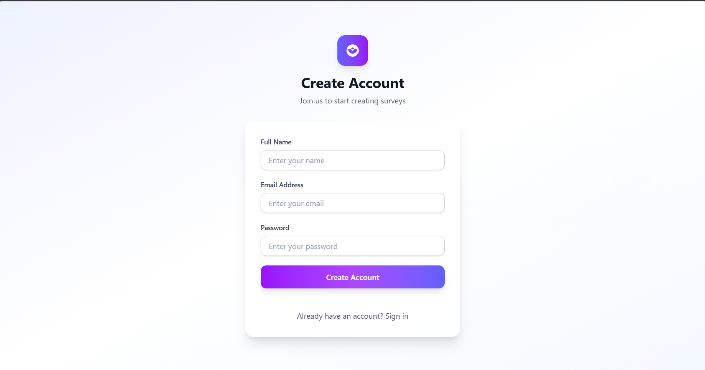

Here’s your README formatted as proper Markdown code:


# 🌊 Waterlily Survey App
A full-stack Survey Application built as part of the **Waterlily Technical Take-Home Assignment**.

This project demonstrates the ability to build both a frontend survey interface and a backend API with authentication and database integration. Users can sign up, log in, answer survey questions, and review their submitted responses.

---

## 📑 Table of Contents
- [Overview](#-overview)  
- [Features](#-features)  
- [Tech Stack](#-tech-stack)  
- [Setup & Installation](#-setup--installation)  
  - [Frontend](#-frontend-setup)  
  - [Backend](#-backend-setup)  
- [Screenshots](#-screenshots)  
- [Potential Improvements](#-potential-improvements)  
- [Notes & Trade-offs](#-notes--trade-offs)  
- [Contributing](#-contributing)  
- [License](#-license)  
- [Contact](#-contact)  

---

## 📌 Overview
The application is a simplified version of Waterlily's user intake form system, which collects demographic, health, and financial information.

Users can:
- Authenticate (sign up & log in)
- Answer survey questions one-by-one with progress tracking
- Submit their responses via API
- Review submitted answers in a session history
- View detailed session responses

---

## ✨ Features

### 🎯 Frontend
- **Authentication System**: Login and registration with form validation  
- **Interactive Survey**: Question-by-question progression with progress bar  
- **Responsive Design**: Clean UI built with Tailwind CSS  
- **State Management**: Zustand for global state management  
- **Type Safety**: Full TypeScript implementation  
- **Session Management**: View and manage survey sessions  
- **Real-time Validation**: Form validation and error handling  

### ⚡ Backend
- **RESTful API**: Clean API endpoints for survey operations  
- **Authentication**: JWT-based secure authentication  
- **Database Integration**: SQL database with proper schema design  
- **Error Handling**: Comprehensive error handling and validation  
- **Type Safety**: Full TypeScript implementation  

---

## 🛠 Tech Stack

### Frontend
- React 18 with TypeScript  
- Vite for build tooling  
- Tailwind CSS for styling  
- Zustand for state management  
- React Router for navigation  
- Axios for API calls  

### Backend
- Node.js with Express  
- TypeScript for type safety  
- JWT for authentication  
- SQL Database (MySQL)  
- Axios for HTTP requests  

---

## ⚡ Setup & Installation

### 🔹 Prerequisites
- Node.js (v16 or higher)  
- npm
- SQL database (MySQL)  

---

### 🔹 Frontend Setup
# Navigate to frontend directory
cd waterlily-frontend

# Install dependencies
npm install

Start development server:

```bash
npm run dev
```

Frontend will run on [http://localhost:5173](http://localhost:5173).

---

### 🔹 Backend Setup

```bash
# Navigate to backend directory
cd waterlily-backend

# Install dependencies
npm install

# Configure environment variables
cp .env.example .env
```

Start development server:

```bash
npm start
```

Backend will run on [http://localhost:3000](http://localhost:3000).

---

## 📸 Screenshots

🏠 **Login Page**


🏠 **Register Page**


📝 **Survey Interface**


📊 **Session History**


🔍 **Response Details**


---

## 🚀 Potential Improvements

### Short-term Enhancements

* Email verification for user registration
* Password reset functionality
* Survey pagination for better performance with many questions
* Real-time validation improvements
* Enhanced mobile responsiveness

### Medium-term Features

* Survey templates system
* Advanced analytics for survey responses
* Export functionality (CSV, PDF)
* Admin dashboard for managing surveys
* Collaborative survey editing


---

## 📝 Notes & Trade-offs

### Technical Decisions

* **Zustand over Redux**: Chosen for simpler state management with less boilerplate
* **Tailwind CSS**: Selected for rapid UI development and consistency
* **SQL Database**: Chosen for structured data relationships and ACID compliance
* **JWT Authentication**: Implemented for stateless authentication and scalability

### Time Constraints

* Prioritized core functionality over advanced features
* Focused on mobile-responsive but not mobile-first design
* Basic error handling implemented with room for enhancement
* Chosen simplicity over complex animation systems

### Design Philosophy

* **User Experience**: Clear navigation and progress indicators
* **Performance**: Optimized re-renders with proper state management
* **Maintainability**: Clean component structure and TypeScript coverage
* **Scalability**: Modular architecture for future feature additions

---

## 📄 License

This project is created as part of a **technical assessment**. Please respect the assignment guidelines and do not distribute without permission.

---

## 👥 Contact

For questions about this implementation, please reach out through the appropriate channels as specified in your assignment instructions.

---

<div align="center">
  Built with ❤️ for the Waterlily Technical Assessment
</div>
